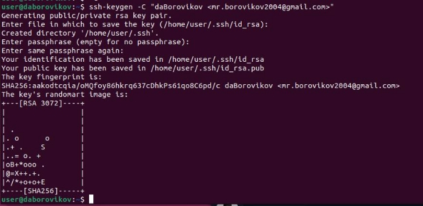
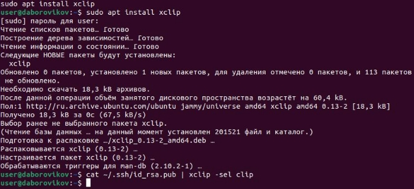
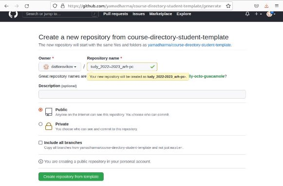
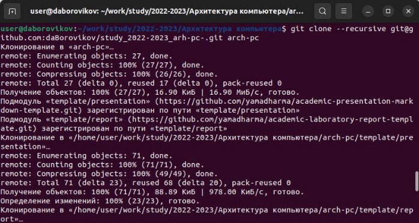
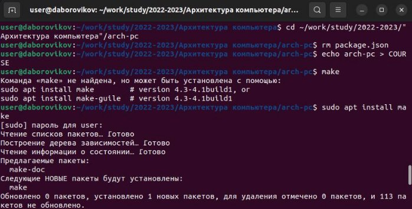
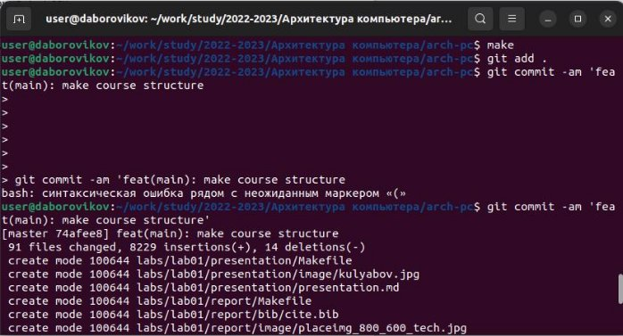
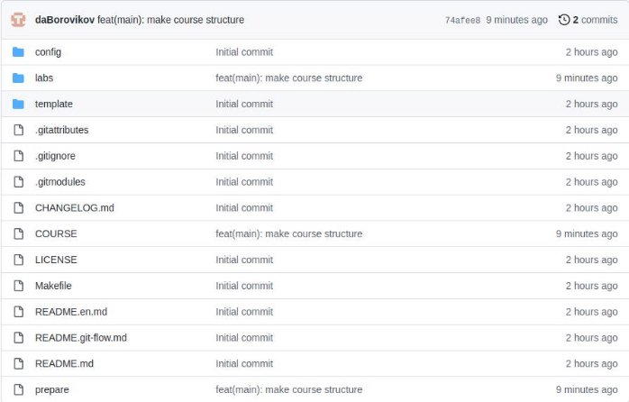
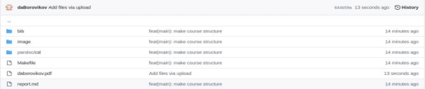

---
## Front matter
title: "Лабораторная работа №3"
subtitle: "Система контроля версий Git"
author: "Боровиков Даниил Александрович"

## Generic otions
lang: ru-RU
toc-title: "Содержание"

## Bibliography
bibliography: bib/cite.bib
csl: pandoc/csl/gost-r-7-0-5-2008-numeric.csl

## Pdf output format
toc: true # Table of contents
toc-depth: 2
lof: true # List of figures
fontsize: 12pt
linestretch: 1.5
papersize: a4
documentclass: scrreprt
## I18n polyglossia
polyglossia-lang:
  name: russian
  options:
	- spelling=modern
	- babelshorthands=true
polyglossia-otherlangs:
  name: english
## I18n babel
babel-lang: russian
babel-otherlangs: english
## Fonts
mainfont: PT Serif
romanfont: PT Serif
sansfont: PT Sans
monofont: PT Mono
mainfontoptions: Ligatures=TeX
romanfontoptions: Ligatures=TeX
sansfontoptions: Ligatures=TeX,Scale=MatchLowercase
monofontoptions: Scale=MatchLowercase,Scale=0.9
## Biblatex
biblatex: true
biblio-style: "gost-numeric"
biblatexoptions:
  - parentracker=true
  - backend=biber
  - hyperref=auto
  - language=auto
  - autolang=other*
  - citestyle=gost-numeric
## Pandoc-crossref LaTeX customization
figureTitle: "Рис."
tableTitle: "Таблица"
listingTitle: "Листинг"
lofTitle: "Список иллюстраций"
lotTitle: "Список таблиц"
lolTitle: "Листинги"
## Misc options
indent: true
header-includes:
  - \usepackage{indentfirst}
  - \usepackage{float} # keep figures where there are in the text
  - \floatplacement{figure}{H} # keep figures where there are in the text
---

# Цель работы

Здесь приводится формулировка цели лабораторной работы. Формулировки
цели для каждой лабораторной работы приведены в методических
указаниях.

Цель данного шаблона --- максимально упростить подготовку отчётов по
лабораторным работам.  Модифицируя данный шаблон, студенты смогут без
труда подготовить отчёт по лабораторным работам, а также познакомиться
с основными возможностями разметки Markdown.

# Выполнение лабораторной работы

1. **Базовая настройка git.** 

Выполним предварительную конфигурацию git. (рис. [-@fig:001])

{ #fig:001 width=70% }

Настроим utf-8 в выводе сообщений git.  (рис. [-@fig:002])

{ #fig:002 width=70% }

Зададим имя начальной ветки. (рис. [-@fig:003])

{ #fig:003 width=70% }

Задаем одинаковые переводы строк текстовых файлов в главном репзитории.  (рис. [-@fig:004])

{ #fig:004 width=70% }

Настройка предупреждения об обратимости преобразования для текущей настройки core.autocrlf.   (рис. [-@fig:005])

{ #fig:005 width=70% }

2. **Создание SSH ключа.** 

Сгенерируем пару ключей (приватный и обычный).  (рис. [-@fig:006])

{ #fig:006 width=70% }

Копируем ключ из локальной консоли в буфер обмена при помощи команды  “cat ~/.ssh/id\_rsa.pub | xclip -sel clip”  (рис. [-@fig:007])

{ #fig:007 width=70% }

Загружаем сгенерированный открытый ключ на github  (рис. [-@fig:008])

{ #fig:008 width=70% }

3. **Cоздание рабочего пространства и репозитория курса на основе шаблона** 

Создадим каталог для предмета «Архитектура компьютера» командой:  - mkdir -p ~/work/study/2022-2023/"Архитектура компьютера"”  (рис. [-@fig:009])

{ #fig:009 width=70% }

Создадим репозиторий на основе шаблона при помощи вебинтерфейса github. (рис. [-@fig:010])

{ #fig:010 width=70% }

Перейдем в каталог курса  командой в терминале:cd ~/work/study/2022-2023/"Архитектура компьютера"/arch-pc”  (рис. [-@fig:011])

{ #fig:011 width=70% }

Клонируем репозиторий с помщью ссылки на странице созданного репозитория  (рис. [-@fig:012])

{ #fig:012 width=70% }

4. **Настройка каталога курса** 

Переходим в каталог курса (команда cd ~/work/study/2022-2023/"Архитектура компьютера"/arch-pc).Удаляем лишние файлы: rm package.json Создаем необходимые каталоги («echo arch-pc > COURSE» , «make») Отправляем файлы на сервер 
(«git add .», «git commit -am 'feat(main): make course structure'», «git push») (рис. [-@fig:013]) (рис. [-@fig:014]) (рис. [-@fig:015])

{ #fig:013 width=70% }

{ #fig:014 width=70% }

{ #fig:015 width=70% }

Проверяем правильность создания иерархии рабочего пространства в локальном репозитории  и на странице github.  (рис. [-@fig:016])

{ #fig:016 width=70% }

5. **Задания для самостоятельной работы** 

Скопируем отчеты по выполнению предыдущих лабораторных работ в соответствующие каталоги созданного рабочего пространства и загрузим файлы на github. (рис. [-@fig:017])  (рис. [-@fig:018])

{ #fig:017 width=70% }

{ #fig:018 width=70% }

Затем создаем отчет по выполнению лабораторной работы в соответствующем каталоге рабочего пространства (labs>lab03>report). Ссылка на github: 

# Выводы

Я изучил идеологию и применение средств контроля версий, а также приобрел практические навыки по работе с системой git. 
11 

