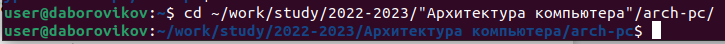

---
## Front matter
title: "Отчёт по лабораторной работе №4"
subtitle: "Язык разметки Markdown"
author: "Боровиков Даниил Александрович"

## Generic otions
lang: ru-RU
toc-title: "Содержание"

## Bibliography
bibliography: bib/cite.bib
csl: pandoc/csl/gost-r-7-0-5-2008-numeric.csl

## Pdf output format
toc: true # Table of contents
toc-depth: 2
lof: true # List of figures
fontsize: 12pt
linestretch: 1.5
papersize: a4
documentclass: scrreprt
## I18n polyglossia
polyglossia-lang:
  name: russian
  options:
	- spelling=modern
	- babelshorthands=true
polyglossia-otherlangs:
  name: english
## I18n babel
babel-lang: russian
babel-otherlangs: english
## Fonts
mainfont: PT Serif
romanfont: PT Serif
sansfont: PT Sans
monofont: PT Mono
mainfontoptions: Ligatures=TeX
romanfontoptions: Ligatures=TeX
sansfontoptions: Ligatures=TeX,Scale=MatchLowercase
monofontoptions: Scale=MatchLowercase,Scale=0.9
## Biblatex
biblatex: true
biblio-style: "gost-numeric"
biblatexoptions:
  - parentracker=true
  - backend=biber
  - hyperref=auto
  - language=auto
  - autolang=other*
  - citestyle=gost-numeric
## Pandoc-crossref LaTeX customization
figureTitle: "Рис."
tableTitle: "Таблица"
listingTitle: "Листинг"
lofTitle: "Список иллюстраций"
lolTitle: "Листинги"
## Misc options
indent: true
header-includes:
  - \usepackage{indentfirst}
  - \usepackage{float} # keep figures where there are in the text
  - \floatplacement{figure}{H} # keep figures where there are in the text
---

# Цель работы

Целью работы является освоение процедуры оформления отчетов с помощью
легковесного языка разметки Markdown

# Выполнение лабораторной работы

Перейдем в каталог курса сформированный при выполнении лабораторной работы No3 при помощи команды: cd ~/work/study/2022-2023/"Архитектура компьютера"/arch-pc/ (рис. [-@fig:001])

{ #fig:001 width=70% }

Обновим локальный репозиторий, скачав изменения из удаленного репозитория с помощью команды
git pull (рис. [-@fig:002])

{ #fig:002 width=70% }

Перейдем в каталог с шаблоном отчета по лабораторной работе No 4 командой:
cd ~/work/study/2022-2023/"Архитектура
компьютера"/arch-pc/labs/lab04/report(рис. [-@fig:003])

{ #fig:003 width=70% }

Проведем компиляцию шаблона с использованием Makefile. Для этого
введем команду make 
При успешной компиляции должны сгенерироваться файлы report.pdf и
report.docx. Проверим корректность полученных файлов(рис. [-@fig:004])

{ #fig:004 width=70% }

Удалим полученный файлы с использованием Makefile. Для этого введем
команду make clean
Проверим, что после этой команды файлы report.pdf и report.docx были
удалены.(рис. [-@fig:005])

{ #fig:006 width=70% }

Ссылка на репозиторий Github, содержащий отчёт о выполнении ра-
боты No3: https://github.com/daBorovikov/study_2022-2023_arh-pc-/tree/master/labs/lab03/report

# Выводы

Мы освоили процедуры оформления отчетов с помощью легковесного языка разметки Markdown.

