---
## Front matter
title: "Отчёт по лабораторной работе №5"
subtitle: "Лабораторная работа No5. Создание и
процесс обработки программ на языке
ассемблера NASM"
author: "Боровиков Даниил Александрович"

## Generic otions
lang: ru-RU
toc-title: "Содержание"

## Bibliography
bibliography: bib/cite.bib
csl: pandoc/csl/gost-r-7-0-5-2008-numeric.csl

## Pdf output format
toc: true # Table of contents
toc-depth: 2
lof: true # List of figures
fontsize: 12pt
linestretch: 1.5
papersize: a4
documentclass: scrreprt
## I18n polyglossia
polyglossia-lang:
  name: russian
  options:
	- spelling=modern
	- babelshorthands=true
polyglossia-otherlangs:
  name: english
## I18n babel
babel-lang: russian
babel-otherlangs: english
## Fonts
mainfont: PT Serif
romanfont: PT Serif
sansfont: PT Sans
monofont: PT Mono
mainfontoptions: Ligatures=TeX
romanfontoptions: Ligatures=TeX
sansfontoptions: Ligatures=TeX,Scale=MatchLowercase
monofontoptions: Scale=MatchLowercase,Scale=0.9
## Biblatex
biblatex: true
biblio-style: "gost-numeric"
biblatexoptions:
  - parentracker=true
  - backend=biber
  - hyperref=auto
  - language=auto
  - autolang=other*
  - citestyle=gost-numeric
## Pandoc-crossref LaTeX customization
figureTitle: "Рис."
tableTitle: "Таблица"
listingTitle: "Листинг"
lofTitle: "Список иллюстраций"
lolTitle: "Листинги"
## Misc options
indent: true
header-includes:
  - \usepackage{indentfirst}
  - \usepackage{float} # keep figures where there are in the text
  - \floatplacement{figure}{H} # keep figures where there are in the text
---

# Цель работы

Освоение процедуры компиляции и сборки программ, написанных на ассем-
блере NASM.

# Выполнение лабораторной работы

Создадим каталог для работы с программами на языке ассемблера NASM командой: mkdir ~/work/arch-pc/lab05(рис. [-@fig:001])

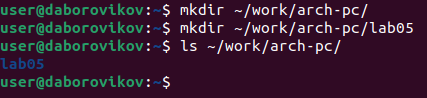{ #fig:001 width=70% }

Перейдем в созданный каталог(рис. [-@fig:002])

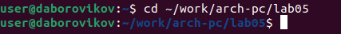{ #fig:002 width=70% }

Создадим текстовый файл с именем hello.asm командой: touch hello.asm(рис. [-@fig:003])

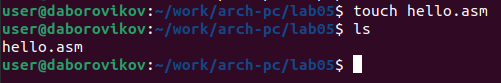{ #fig:003 width=70% }

Откроем этот файл с помощью текстового редактора gedit: gedit hello.asm(рис. [-@fig:004])

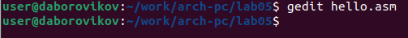{ #fig:004 width=70% }

Введем  файл текст программы(рис. [-@fig:005])

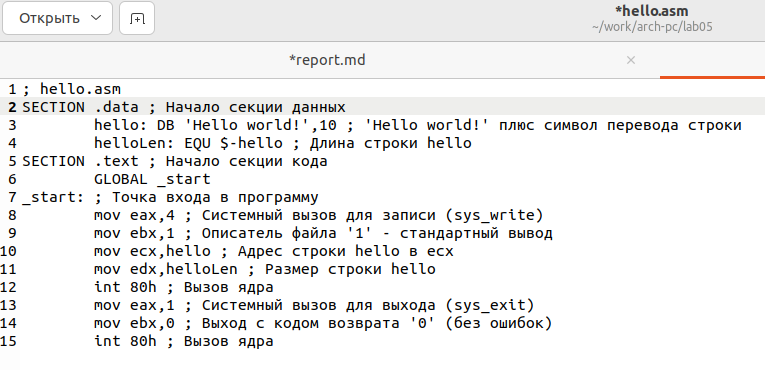{ #fig:005 width=70% }

Скомпилируем программу(рис. [-@fig:006])

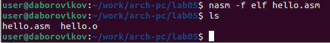{ #fig:006 width=70% }

Выполним следующую команду: nasm -o obj.o -f elf -g -l list.lst hello.asm(рис. [-@fig:007])

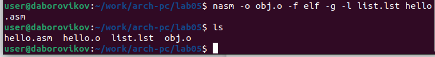{ #fig:007 width=70% }

Передадим обьектный файл на обработку компановщику: ld -m elf_i386 hello.o -o hellom(рис. [-@fig:008])

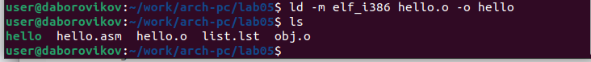{ #fig:008 width=70% }

Запустим созданный исполняемый файл, находящийся в текущем каталоге командой: ./hello(рис. [-@fig:009])

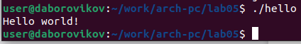{ #fig:009 width=70% }

 Самостоятельная работа

В каталоге ~/work/arch-pc/lab05 с помощью команды cp создадим копию файла hello.asm с именем lab5.asm(рис. [-@fig:010])

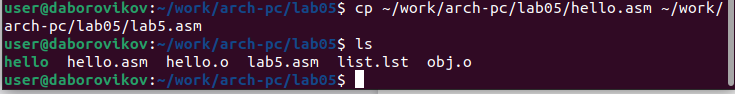{ #fig:010 width=70% }

С помощью текстового редактора gedit внесем изменения в текст программы в файле lab5.asm так, чтобы вместо Hello world! на экран выводилась строка с фамилией и именем.(рис. [-@fig:011])

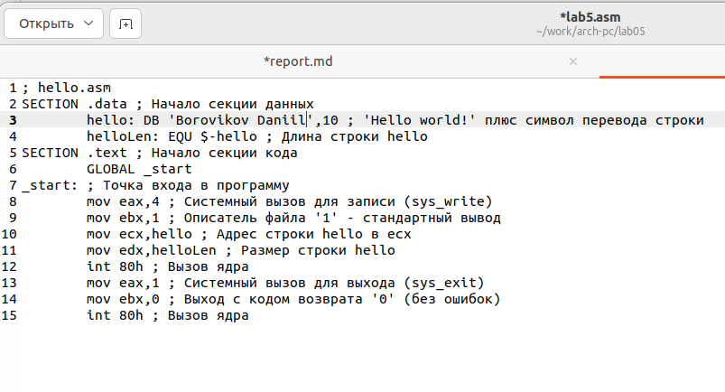{ #fig:011 width=70% }

Оттранслируем полученный текст программы lab5.asm в объектный файл. Выполним компоновку объектного файла и запустим получившийся исполняемый файл.(рис. [-@fig:012])

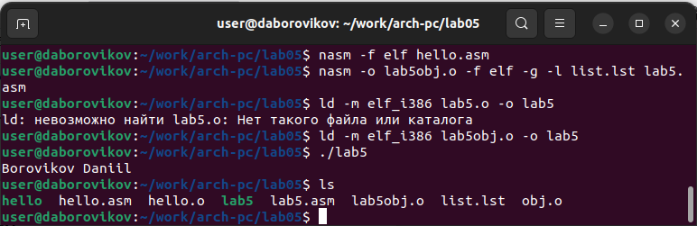{ #fig:012 width=70% }

Скопируем файлы hello.asm и lab5.asm в локальный репозиторий в каталог ~/work/study/2022-2023/"Архитектура компьютера"/arch-
pc/labs/lab05/. Загрузим файлы на Github.(рис. [-@fig:013])

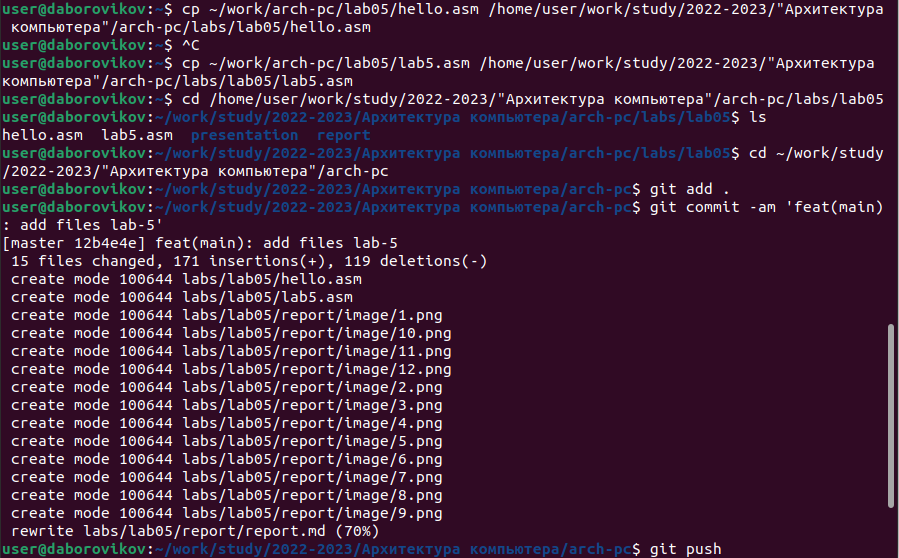{ #fig:013 width=70% }

Ссылка на github: https://github.com/daBorovikov/study_2022-2023_arh-pc-

# Выводы

В ходе лабораторной работы мы освоили процедуры компиляции и сборки программ, написанных на ассемблере NASM, и написали собственную программу "hello world"
