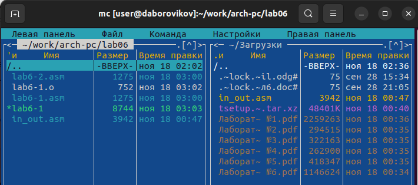

---
## Front matter
title: "Лабораторная работа №6. "
subtitle: "Основы работы с Midnight Commander (mc). Структура программы на языке ассемблера NASM. Системные вызовы в ОС GNU Linux"
author: "Боровиков Даниил Александрович"

## Generic otions
lang: ru-RU
toc-title: "Содержание"

## Bibliography
bibliography: bib/cite.bib
csl: pandoc/csl/gost-r-7-0-5-2008-numeric.csl

## Pdf output format
toc: true # Table of contents
toc-depth: 2
lof: true # List of figures
fontsize: 12pt
linestretch: 1.5
papersize: a4
documentclass: scrreprt
## I18n polyglossia
polyglossia-lang:
  name: russian
  options:
	- spelling=modern
	- babelshorthands=true
polyglossia-otherlangs:
  name: english
## I18n babel
babel-lang: russian
babel-otherlangs: english
## Fonts
mainfont: PT Serif
romanfont: PT Serif
sansfont: PT Sans
monofont: PT Mono
mainfontoptions: Ligatures=TeX
romanfontoptions: Ligatures=TeX
sansfontoptions: Ligatures=TeX,Scale=MatchLowercase
monofontoptions: Scale=MatchLowercase,Scale=0.9
## Biblatex
biblatex: true
biblio-style: "gost-numeric"
biblatexoptions:
  - parentracker=true
  - backend=biber
  - hyperref=auto
  - language=auto
  - autolang=other*
  - citestyle=gost-numeric
## Pandoc-crossref LaTeX customization
figureTitle: "Рис."
tableTitle: "Таблица"
listingTitle: "Листинг"
lofTitle: "Список иллюстраций"
lotTitle: "Список таблиц"
lolTitle: "Листинги"
## Misc options
indent: true
header-includes:
  - \usepackage{indentfirst}
  - \usepackage{float} # keep figures where there are in the text
  - \floatplacement{figure}{H} # keep figures where there are in the text
---

# Цель работы

Приобретение практических навыков работы в Midnight Commander. Освоение
инструкций языка ассемблера mov и int.

# Выполнение лабораторной работы

Откроем Midnight Commander(рис. [-@fig:001])

{ #fig:001 width=70% }

Перейдем в каталог ~/work/arch-pc созданный при выполнении лабораторной работы №5(рис. [-@fig:002])

{ #fig:002 width=70% }

С помощью функциональной клавиши F7 создадим папку lab06 и перейдем в созданный каталог.(рис. [-@fig:003])

{ #fig:003 width=70% }

Пользуясь строкой ввода и командой touch создадим файл lab6-1.asm(рис. [-@fig:004])

{ #fig:004 width=70% }

С помощью функциональной клавиши F4 откроем файл lab6-1.asm для редактирования во встроенном редакторе. В качестве редактора выберем nano(рис. [-@fig:005])

{ #fig:005 width=70% }

Введем текст программы из листинга 6.1, созраним его и закроем файл(рис. [-@fig:006])

{ #fig:006 width=70% }

С помощью функциональной клавиши F3 откроем файл lab6-1.asm для просмотра и убедимся, что файл содержит текст программы.(рис. [-@fig:007])

{ #fig:007 width=70% }

Оттранслируем текст программы lab6-1.asm в объектный файл. Выполним компоновку объектного файла и запустим получившийся исполняемый файл. Программа выводит строку 'Введите строку:' и ожидает ввода с клавиатуры. На запрос вводим ФИО.(рис. [-@fig:008])

{ #fig:008 width=70% }

Скопируем файл in_out.asm в каталог с файлом lab6-1.asm с помощью функциональной клавиши F5(рис. [-@fig:009])

{ #fig:009 width=70% }

С помощью функциональной клавиши F6 создадим копию файла lab6-1.asm с именем lab6-2.asm.(рис. [-@fig:010])

{ #fig:010 width=70% }

Исправьте текст программы в файле lab6-2.asm с использование подпрограмм из внешнего файла in_out.asm (используйте подпрограммы sprintLF, sread и quit) в соответствии с листингом 6.2.(рис. [-@fig:011])

{ #fig:011 width=70% }

Создадим исполняемый файл и проверим его работу(рис. [-@fig:012])

{ #fig:012 width=70% }

В файле lab6-2.asm заменим подпрограмму sprintLF на sprint. Создадим исполняемый файл и проверьте его работу. Выясним, что от первоначальной версии полученная программа отличается вводом и выводом на одной строке(рис. [-@fig:013])

{ #fig:013 width=70% }

# Самостоятельная работа

Программа работающая по алгоритму без использования подпрограмм: 

вывести приглашение типа “Введите строку:”;

ввести строку с клавиатуры;

вывести введённую строку на экран.(рис. [-@fig:014])

Листинг программы:

SECTION .data ; Секция инициированных данных

msg: DB 'Введите строку:',10

msgLen: EQU $-msg ; Длина переменной 'msg'

SECTION .bss ; Секция не инициированных данных

buf1: RESB 80 ; Буфер размером 80 байт

SECTION .text ; Код программы

GLOBAL _start ; Начало программы

_start: ; Точка входа в программу

mov eax,4 ; Системный вызов для записи (sys_write)

mov ebx,1 ; Описатель файла 1 - стандартный вывод

mov ecx,msg ; Адрес строки 'msg' в 'ecx'

mov edx,msgLen ; Размер строки 'msg' в 'edx'

int 80h ; Вызов ядра

mov eax, 3 ; Системный вызов для чтения (sys_read)

mov ebx, 0 ; Дескриптор файла 0 - стандартный ввод

mov ecx, buf1 ; Адрес буфера под вводимую строку

mov edx, 80 ; Длина вводимой строки

int 80h ; Вызов ядра

mov eax,4 ; Системный вызов для записи (sys_write)

mov ebx,1 ; Описатель файла '1' - стандартный вывод

mov ecx,buf1 ; Адрес строки buf1 в ecx

mov edx,buf1 ; Размер строки buf1

int 80h ; Вызов ядра

mov eax,1 ; Системный вызов для выхода (sys_exit)

mov ebx,0 ; Выход с кодом возврата 0 (без ошибок)

int 80h ; Вызов ядра

{ #fig:014 width=70% }

Получим исполняемый файл требуемой программы и проверим его работу. На приглашение
ввести строку введем свою фамилию(рис. [-@fig:015])

{ #fig:015 width=70% }

Программа работающая по алгоритму с использованием подпрограмм: 

вывести приглашение типа “Введите строку:”;

ввести строку с клавиатуры;

вывести введённую строку на экран.(рис. [-@fig:016])

Листинг программы:

%include 'in_out.asm'

SECTION .data ; Секция инициированных данных

msg: DB 'Введите строку: ',0h ; сообщение

SECTION .bss ; Секция не инициированных данных

buf1: RESB 80 ; Буфер размером 80 байт

SECTION .text ; Код программы

GLOBAL _start ; Начало программы

_start: ; Точка входа в программу

mov eax, msg ; запись адреса выводимого сообщения в `EAX`

call sprint ; вызов подпрограммы печати сообщения

mov ecx, buf1 ; запись адреса переменной в `EAX`

mov edx, 80 ; запись длины вводимого сообщения в `EBX`

call sread ; вызов подпрограммы ввода сообщения

mov eax,4 ; Системный вызов для записи (sys_write)

mov ebx,1 ; Описатель файла '1' - стандартный вывод

mov ecx,buf1 ; Адрес строки buf1 в ecx

int 80h ; Вызов ядра

call quit ; вызов подпрограммы завершения

{ #fig:016 width=70% }

Получим исполняемый файл требуемой программы и проверим его работу. На приглашение
ввести строку введем свою фамилию(рис. [-@fig:017])

{ #fig:017 width=70% }

Ссылка на github: https://github.com/daBorovikov/study_2022-2023_arh-pc-

# Выводы

В ходе лабораторной работы мы приобрели практические навыки работы в Midnight Commander, освоили инструкции языка ассемблера mov и int.

