---
## Front matter
title: "Лабораторная работа №7. "
subtitle: "Арифметические операции в NASM"
author: "Боровиков Даниил Александрович"

## Generic otions
lang: ru-RU
toc-title: "Содержание"

## Bibliography
bibliography: bib/cite.bib
csl: pandoc/csl/gost-r-7-0-5-2008-numeric.csl

## Pdf output format
toc: true # Table of contents
toc-depth: 2
lof: true # List of figures
fontsize: 12pt
linestretch: 1.5
papersize: a4
documentclass: scrreprt
## I18n polyglossia
polyglossia-lang:
  name: russian
  options:
	- spelling=modern
	- babelshorthands=true
polyglossia-otherlangs:
  name: english
## I18n babel
babel-lang: russian
babel-otherlangs: english
## Fonts
mainfont: PT Serif
romanfont: PT Serif
sansfont: PT Sans
monofont: PT Mono
mainfontoptions: Ligatures=TeX
romanfontoptions: Ligatures=TeX
sansfontoptions: Ligatures=TeX,Scale=MatchLowercase
monofontoptions: Scale=MatchLowercase,Scale=0.9
## Biblatex
biblatex: true
biblio-style: "gost-numeric"
biblatexoptions:
  - parentracker=true
  - backend=biber
  - hyperref=auto
  - language=auto
  - autolang=other*
  - citestyle=gost-numeric
## Pandoc-crossref LaTeX customization
figureTitle: "Рис."
tableTitle: "Таблица"
listingTitle: "Листинг"
lofTitle: "Список иллюстраций"
lotTitle: "Список таблиц"
lolTitle: "Листинги"
## Misc options
indent: true
header-includes:
  - \usepackage{indentfirst}
  - \usepackage{float} # keep figures where there are in the text
  - \floatplacement{figure}{H} # keep figures where there are in the text
---

# Цель работы

Освоение арифметических инструкций языка ассемблера NASM.

# Выполнение лабораторной работы

Создадим каталог для программам лабораторной работы № 7, перейдем в него и создадим файл lab7-1.asm(рис. [-@fig:001])

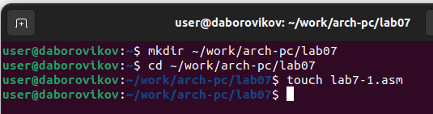{ #fig:001 width=70% }

Введем в файл lab7-1.asm текст программы из листинга 7.1.(рис. [-@fig:002])

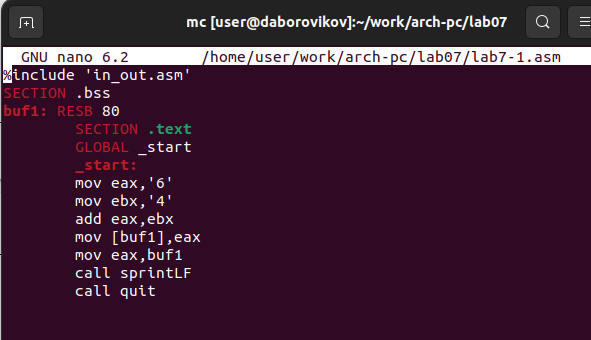{ #fig:002 width=70% }

Создадим исполняемый файл и запустим его.(рис. [-@fig:003])

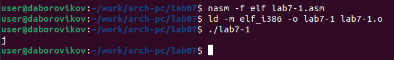{ #fig:003 width=70% }

Далее изменим текст программы и вместо символов, запишем в регистры числа.(рис. [-@fig:004])

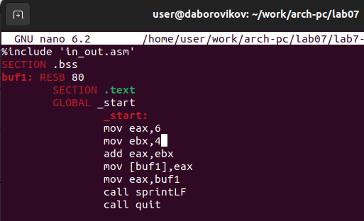{ #fig:004 width=70% }

Создадим исполняемый файл исправленного текста программы lab7-1.asm и запустите его.(рис. [-@fig:005])

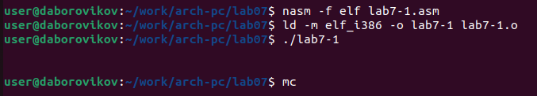{ #fig:005 width=70% }

Пользуясь таблицей ASCII определим, что код 10 соответствует символ LF, \ n. Данный символ не отображается на экране.

Создадим файл lab7-2.asm в каталоге ~/work/arch-pc/lab07 и введите в него текст программы из листинга 7.2.(рис. [-@fig:006])

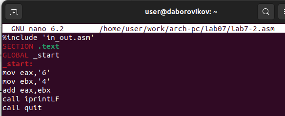{ #fig:006 width=70% }

Создадим исполняемый файл и запустим его(рис. [-@fig:007])

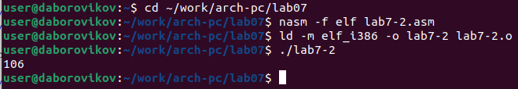{ #fig:007 width=70% }

Аналогично предыдущему примеру изменим символы на числа. Заменим строки

mov eax,'6'

mov ebx,'4

на строки

moveax,6

movebx,4(рис. [-@fig:008])

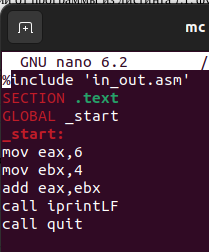{ #fig:008 width=70% }

Создадим измененный исполняемый файл и запустим его(рис. [-@fig:009])

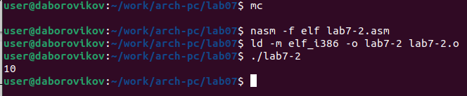{ #fig:009 width=70% }

Заменим функцию iprintLF на iprint(рис. [-@fig:010])

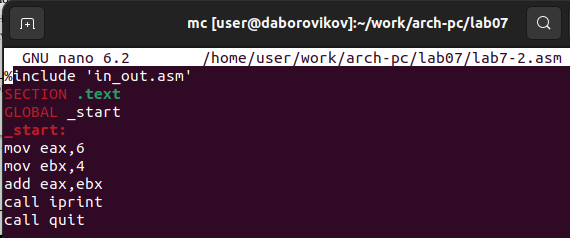{ #fig:010 width=70% }

Создадим измененный исполняемый файл и запустим его(рис. [-@fig:011])

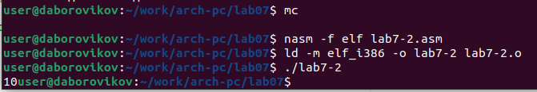{ #fig:011 width=70% }

Вывод функций iprintLF от iprint отличается отсутствием перевода на новую строку

Создадим файл lab7-3.asm в каталоге ~/work/arch-pc/lab07:(рис. [-@fig:012])

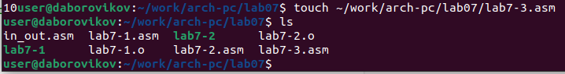{ #fig:012 width=70% }

Введем текст программы из листинга 7.3 в lab7-3.asm.(рис. [-@fig:013])

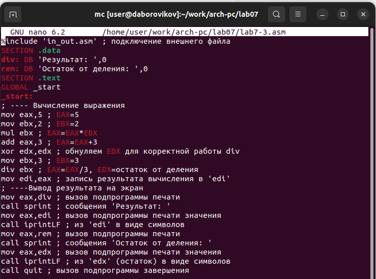{ #fig:013 width=70% }

Создадим исполняемый файл и запустим его(рис. [-@fig:014])

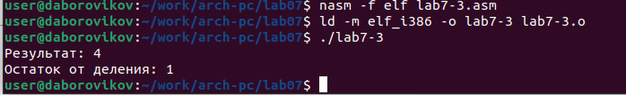{ #fig:014 width=70% }

Изменим текст программы для вычисления выражения 𝑓(𝑥) = (4 ∗ 6 + 2)/5.(рис. [-@fig:015])

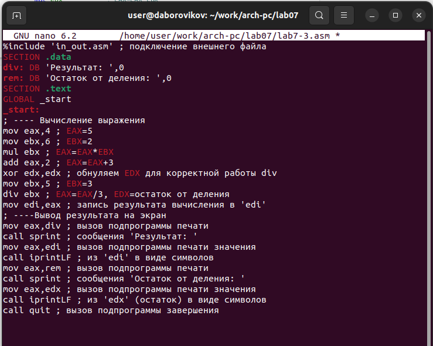{ #fig:015 width=70% }

Создадим исполняемый файл и запустим его(рис. [-@fig:016])

{ #fig:016 width=70% }

Введем текст программы из листинга 7.4 в файлvariant.asm.(рис. [-@fig:017])

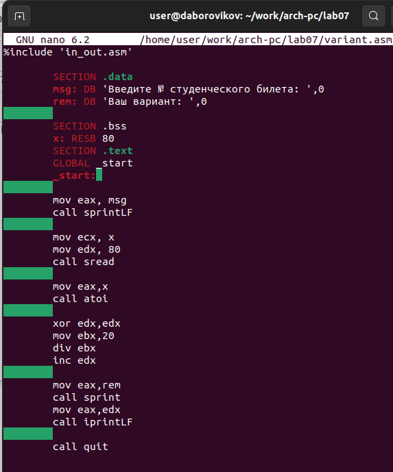{ #fig:017 width=70% }

Создадим исполняемый файл и запустим его(рис. [-@fig:018])

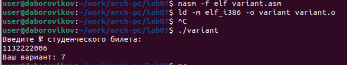{ #fig:018 width=70% }

Мой вариант номер 7

# Ответы на вопросы

1. Какие строки листинга 7.4 отвечают за вывод на экран сообщения ‘Ваш вариант:’?

rem:DB 'Ваш вариант: ',0

mov eax,rem

call sprint

2. Для чего используется следующие инструкции? mov edx, 80 mov ecx, x call sread

Данные инструкции используются для ввода варианта(или другого значения) в переменную x

3. Для чего используется инструкция “call atoi”?

Преобразвание кода ASCII в число

4. Какие строки листинга 7.4 отвечают за вычисления варианта?

xor edx,edx

mov ebx,20

div ebx

inc edx

5. В какой регистр записывается остаток от деления при выполнении инструкции “div ebx”?

В регистр edx

6. Для чего используется инструкция “inc edx”?

Прибавление еденицы к регистру edx

7. Какие строки листинга 7.4 отвечают за вывод на экран результата вычислений?

mov eax,edx

call iprintLF

# Самостоятельная работа

Создадим файл sam.asm и введем текст программы для вычисения выражения (вариант 7) - 5(x-1)^2 (рис. [-@fig:019])

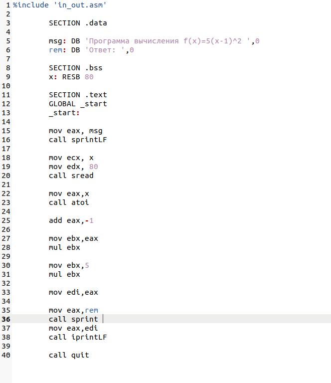{ #fig:019 width=70% }

Создадим исполняемый файл и проверим работу на значениях x1=3 и x2=5. Проверим ответы программы ручных вычислением. Всё работает верно (рис. [-@fig:020])

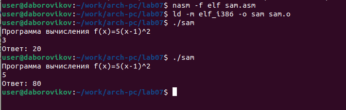{ #fig:020 width=70% }

# Выводы

В ходе лабораторной работы мы освоили арифметические инструкции языка ассемлера NASM.

https://github.com/daBorovikov/study_2022-2023_arh-pc-

