---
## Front matter
title: "Лабораторная работа №8. "
subtitle: "Команды
безусловного и условного переходов в
Nasm. Программирование ветвлений."
author: "Боровиков Даниил Александрович"

## Generic otions
lang: ru-RU
toc-title: "Содержание"

## Bibliography
bibliography: bib/cite.bib
csl: pandoc/csl/gost-r-7-0-5-2008-numeric.csl

## Pdf output format
toc: true # Table of contents
toc-depth: 2
lof: true # List of figures
fontsize: 12pt
linestretch: 1.5
papersize: a4
documentclass: scrreprt
## I18n polyglossia
polyglossia-lang:
  name: russian
  options:
	- spelling=modern
	- babelshorthands=true
polyglossia-otherlangs:
  name: english
## I18n babel
babel-lang: russian
babel-otherlangs: english
## Fonts
mainfont: PT Serif
romanfont: PT Serif
sansfont: PT Sans
monofont: PT Mono
mainfontoptions: Ligatures=TeX
romanfontoptions: Ligatures=TeX
sansfontoptions: Ligatures=TeX,Scale=MatchLowercase
monofontoptions: Scale=MatchLowercase,Scale=0.9
## Biblatex
biblatex: true
biblio-style: "gost-numeric"
biblatexoptions:
  - parentracker=true
  - backend=biber
  - hyperref=auto
  - language=auto
  - autolang=other*
  - citestyle=gost-numeric
## Pandoc-crossref LaTeX customization
figureTitle: "Рис."
tableTitle: "Таблица"
listingTitle: "Листинг"
lofTitle: "Список иллюстраций"
lotTitle: "Список таблиц"
lolTitle: "Листинги"
## Misc options
indent: true
header-includes:
  - \usepackage{indentfirst}
  - \usepackage{float} # keep figures where there are in the text
  - \floatplacement{figure}{H} # keep figures where there are in the text
---

# Цель работы

Изучение команд условного и безусловного переходов. Приобретение навы-
ков написания программ с использованием переходов. Знакомство с назначе-
нием и структурой файла листинга.

# Выполнение лабораторной работы

Создадим каталог для программам лабораторной работы № 8, перейдем в него и создадим файл lab8-1.asm(рис. [-@fig:001])

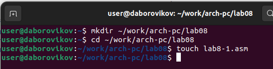{ #fig:001 width=70% }

Введем в файл lab8-1.asm текст программы из листинга 8.1.(рис. [-@fig:002])

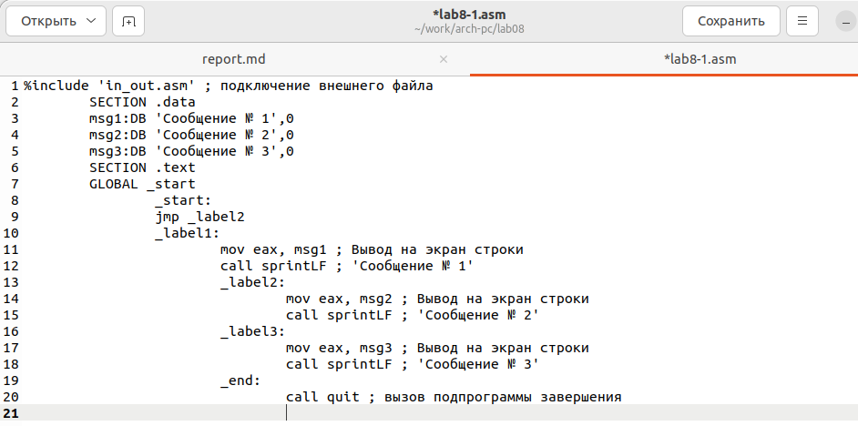{ #fig:002 width=70% }

Создадим исполняемый файл и запустим его.(рис. [-@fig:003])

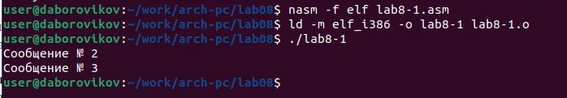{ #fig:003 width=70% }

Далее изменим текст программы в соответствии с листингом 8.2(рис. [-@fig:004])

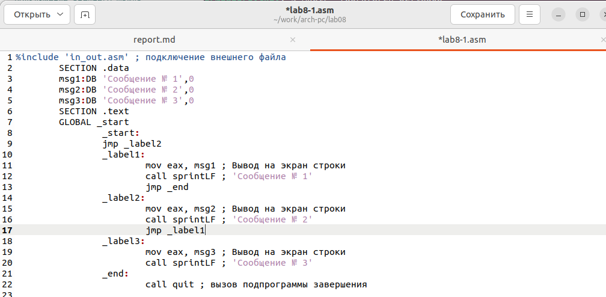{ #fig:004 width=70% }

Создадим исполняемый файл исправленного текста программы lab8-1.asm и запустите его.(рис. [-@fig:005])

{ #fig:005 width=70% }

Текст программы для следующего вывода:

user@dk4n31:~$ ./lab8-1

Сообщение № 3

Сообщение № 2

Сообщение № 1

user@dk4n31:~$(рис. [-@fig:006])

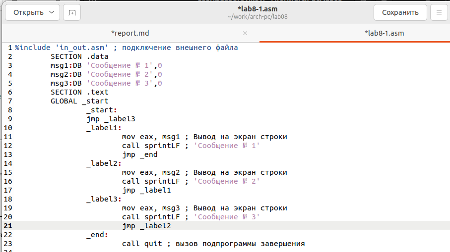{ #fig:006 width=70% }

Создадим исполняемый файл и запустим его(рис. [-@fig:007])

{ #fig:007 width=70% }

Создадим файл lab8-2.asm в каталоге ~/work/arch-pc/lab08. Внимательно изучим текст программы из листинга 8.3 и введем в lab8-2.asm.(рис. [-@fig:008])

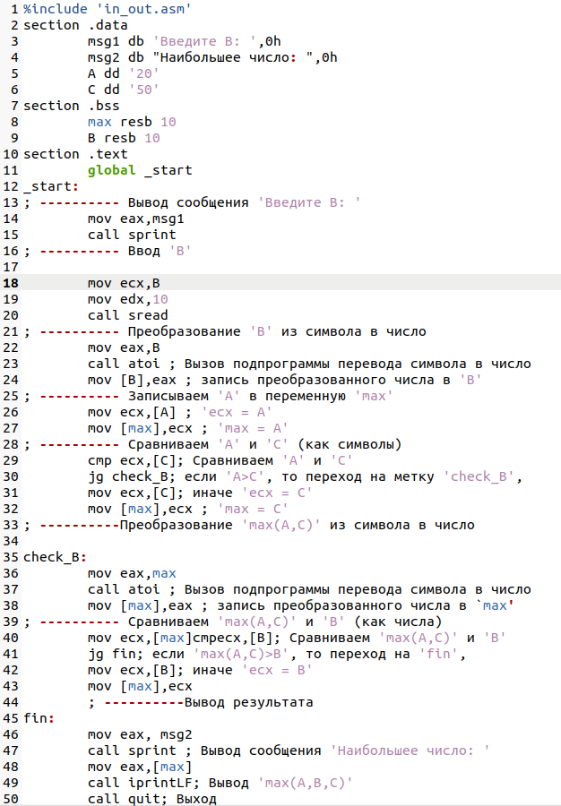{ #fig:008 width=70% }

Создадим измененный исполняемый файл и запустим его(рис. [-@fig:009])

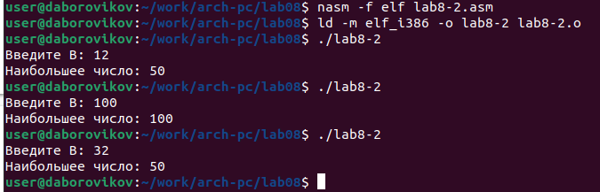{ #fig:009 width=70% }

Создадим файл листинга для программы из файла lab8-2.asm и откроем файл при помощи текстового редактора mcedit(рис. [-@fig:010])

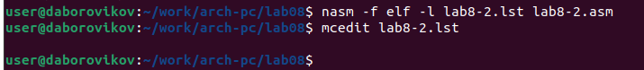{ #fig:010 width=70% }

Разберем три строки листинга программы

21 00000101 B8[0A000000]            	mov eax,B

Значение строки:

		21-номер строки в коде листинга от начала сегмента
		
		00000101 - адрес
		
		B8[0A000000] - машинный код(B8[0A000000] - инструкция mov eax,B ; B8 - обозначет что действие производится с регистром eax, а конкретно mov eax(в данной программе) ;  [0A000000] - ссылка на переменную B)
		
		mov eax,B - исходный текст программы
		
22 00000106 E891FFFFFF              	call atoi ; Вызов подпрограммы перевода символа в число

Значение строки:

		22-номер строки в коде листинга от начала сегмента
		
		00000106 - адрес
		
		E891FFFFFF - машинный код(E891FFFFFF - инструкция call atoi ; E8 - обозначает что работает с с регисторм eax)
		
		call atoi ; Вызов подпрограммы перевода символа в число - исходный текст программы

23 0000010B A3[0A000000]            	mov [B],eax ; запись преобразованного числа в 'B'

Значение строки:

		23-номер строки в коде листинга от начала сегмента
		
		0000010B - адрес
		
		A3[0A000000] - машинный код(A3[0A000000] - инструкция mov [B],eax ; A3 - обозначет что действие производится с регистром eax, а конкретно присваивание значения из eax в другую переменную(в данной программе) ;  [0A000000] - ссылка на переменную B, обозначение, что мы работаем с этой переменной)
		
		mov eax,B - исходный текст программы

(рис. [-@fig:011])

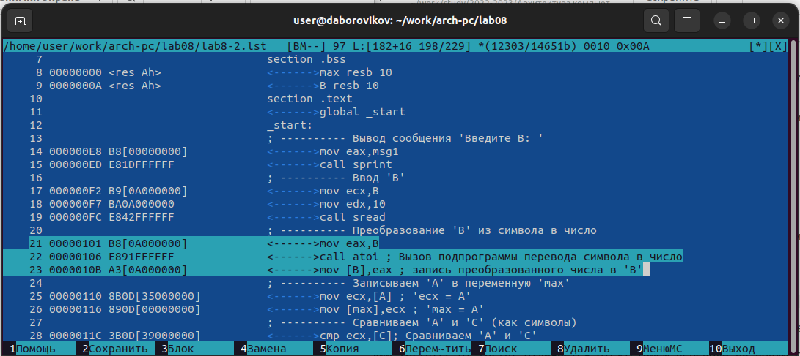{ #fig:011 width=70% }

Откроем файл с программой lab8-2.asm и в любой инструкции с двумя
операндами удалим один операнд. Выполните трансляцию с получением файла
листинга:(рис. [-@fig:012])

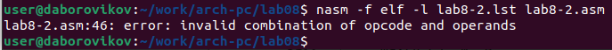{ #fig:012 width=70% }

(рис. [-@fig:013])

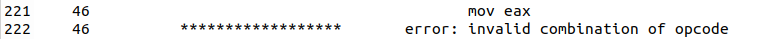{ #fig:013 width=70% }

На выходе получаем листинг lab8-2.lst с ошибкой 46         ******************       error: invalid combination of opcode and operands

#Самостоятельная работа

Мой вариант номер 7

Напишем программу нахождения наименьшей из 3 целочисленных переменных A, B, C. Значения переменных выберем из табл. 8.5 в соответствиис вариантом, полученным при выполнении лабораторной работы № 7. Создадим исполняемый файл и проверьте его работу.(рис. [-@fig:014])

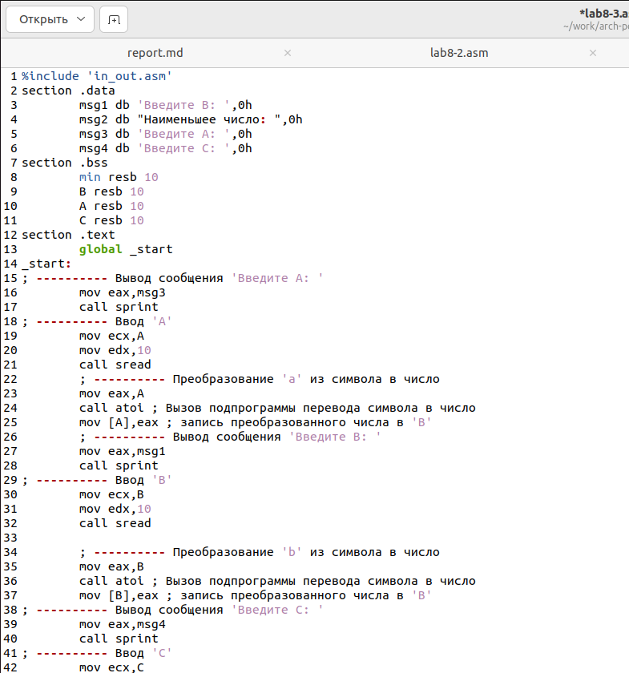{ #fig:014 width=70% }

Текст программы (рис. [-@fig:015])

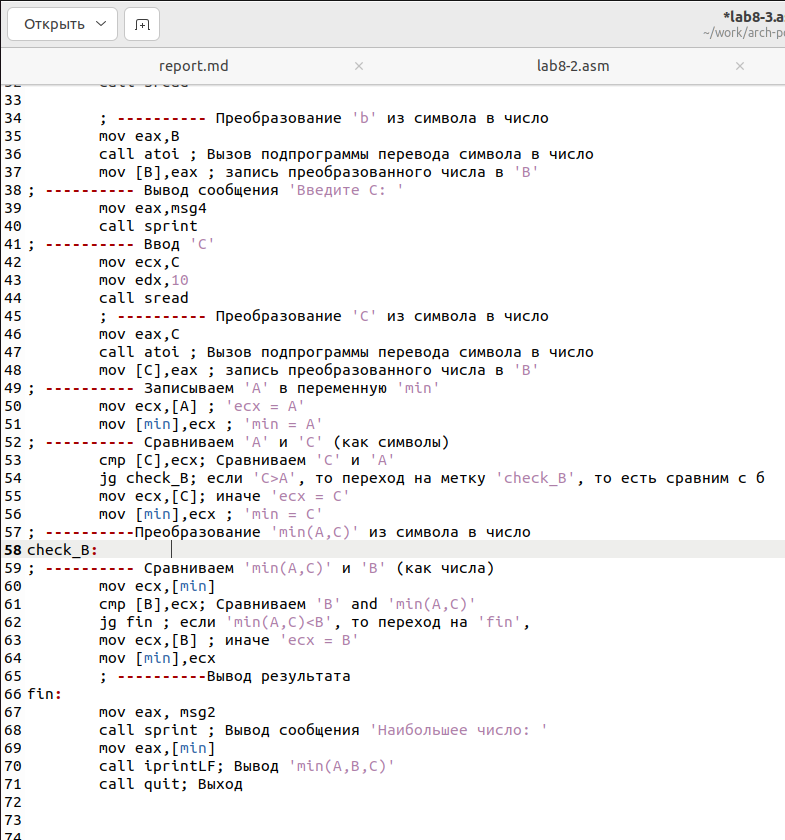{ #fig:015 width=70% }

Проверка работы исполняемого файла(рис. [-@fig:016])

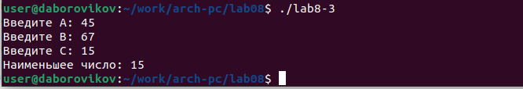{ #fig:016 width=70% }

Листинг программы:

%include 'in_out.asm'

section .data

	msg1 db 'Введите B: ',0h
	
	msg2 db "Наименьшее число: ",0h
	
	msg3 db 'Введите A: ',0h
	
	msg4 db 'Введите C: ',0h
	
section .bss

	min resb 10
	
	B resb 10
	
	A resb 10
	
	C resb 10
	
section .text

	global _start
	
_start:

; ---------- Вывод сообщения 'Введите A: '

	mov eax,msg3
	
	call sprint
	
; ---------- Ввод 'A'

	mov ecx,A
	
	mov edx,10
	
	call sread
	
	; ---------- Преобразование 'a' из символа в число
	
	mov eax,A
	
	call atoi ; Вызов подпрограммы перевода символа в число
	
	mov [A],eax ; запись преобразованного числа в 'B'
	
	; ---------- Вывод сообщения 'Введите B: '
	
	mov eax,msg1
	
	call sprint
	
; ---------- Ввод 'B'

	mov ecx,B
	
	mov edx,10
	
	call sread
	
	; ---------- Преобразование 'b' из символа в число
	
	mov eax,B
	
	call atoi ; Вызов подпрограммы перевода символа в число
	
	mov [B],eax ; запись преобразованного числа в 'B'
	
; ---------- Вывод сообщения 'Введите C: '

	mov eax,msg4
	
	call sprint
	
; ---------- Ввод 'C'

	mov ecx,C
	
	mov edx,10
	
	call sread
	
	; ---------- Преобразование 'C' из символа в число
	
	mov eax,C
	
	call atoi ; Вызов подпрограммы перевода символа в число
	
	mov [C],eax ; запись преобразованного числа в 'B'
	
; ---------- Записываем 'A' в переменную 'min'

	mov ecx,[A] ; 'ecx = A'
	
	mov [min],ecx ; 'min = A'
	
; ---------- Сравниваем 'A' и 'С' (как символы)

	cmp [C],ecx; Сравниваем 'C' и 'A'
	
	jg check_B; если 'C>A', то переход на метку 'check_B', то есть сравним с б
	
	mov ecx,[C]; иначе 'ecx = C'
	
	mov [min],ecx ; 'min = C'
	
; ----------Преобразование 'min(A,C)' из символа в число

check_B:	

; ---------- Сравниваем 'min(A,C)' и 'B' (как числа)

	mov ecx,[min]
	
	cmp [B],ecx; Сравниваем 'B' and 'min(A,C)'
	
	jg fin 
	
	mov ecx,[B] ; иначе 'ecx = B'
	
	mov [min],ecx
	
	; ----------Вывод результата
	
fin:

	mov eax, msg2
	
	call sprint ; Вывод сообщения 'Наибольшее число: '
	
	mov eax,[min]
	
	call iprintLF; Вывод 'min(A,B,C)'
	
	call quit; Выход

Напишем программу, которая для введенных с клавиатуры значений 𝑥 и 𝑎 вычисляет значение заданной функции 𝑓(𝑥) и выводит результат вычислений. Вид функции 𝑓(𝑥) выбрать из таблицы 8.6 вариантов заданий в соответствии с вариантом, полученным при выполнении лабораторной работы № 7. Создайте исполняемый файл и проверьте его работу для значений 𝑥 и 𝑎 из 8.6.(рис. [-@fig:017])

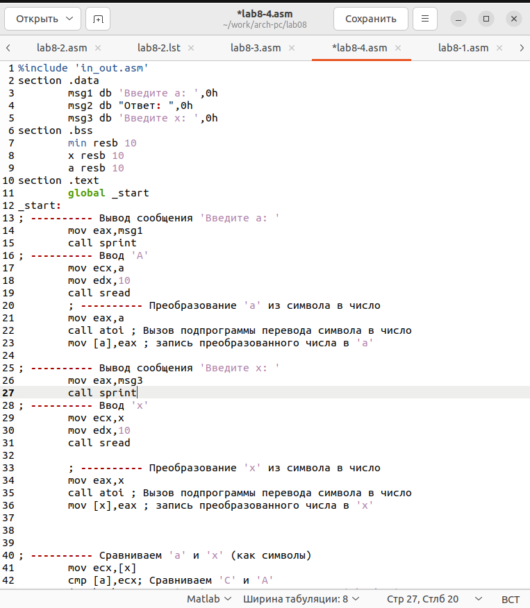{ #fig:017 width=70% }

Листинг программы lab8-4.asm(рис. [-@fig:018])

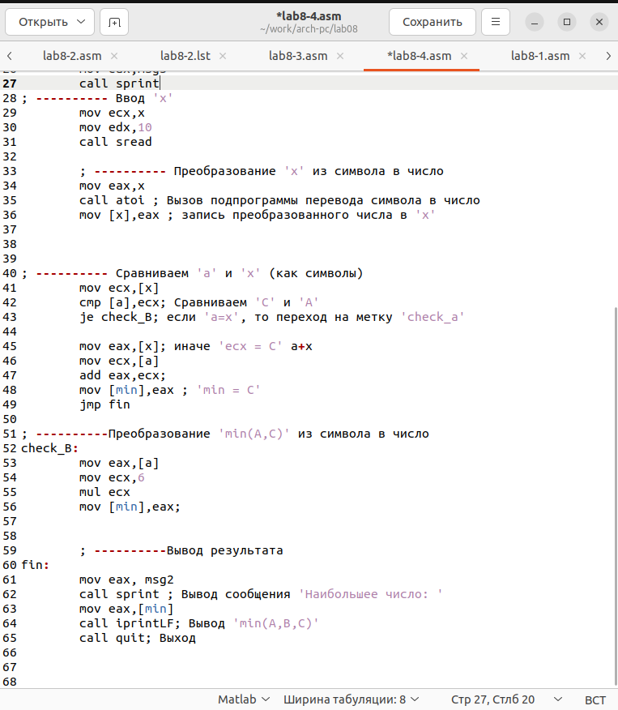{ #fig:018 width=70% }
(рис. [-@fig:019])

{ #fig:019 width=70% }

Листинг программы:

%include 'in_out.asm'

section .data

	msg1 db 'Введите a: ',0h
	
	msg2 db "Ответ: ",0h
	
	msg3 db 'Введите x: ',0h
	
section .bss

	min resb 10
	
	x resb 10
	
	a resb 10
	
section .text

	global _start
	
_start:

; ---------- Вывод сообщения 'Введите a: '

	mov eax,msg1
	
	call sprint
	
; ---------- Ввод 'A'

	mov ecx,a
	
	mov edx,10
	
	call sread
	
	; ---------- Преобразование 'a' из символа в число
	
	mov eax,a
	
	call atoi ; Вызов подпрограммы перевода символа в число
	
	mov [a],eax ; запись преобразованного числа в 'a'
	
	
; ---------- Вывод сообщения 'Введите x: '

	mov eax,msg3
	
	call sprint
	
; ---------- Ввод 'x'

	mov ecx,x
	
	mov edx,10
	
	call sread
	
	; ---------- Преобразование 'x' из символа в число
	
	mov eax,x
	
	call atoi ; Вызов подпрограммы перевода символа в число
	
	mov [x],eax ; запись преобразованного числа в 'x'
	
; ---------- Сравниваем 'a' и 'x' (как символы)

	mov ecx,[x]
	
	cmp [a],ecx; Сравниваем 'C' и 'A'
	
	je check_B; если 'a=x', то переход на метку 'check_a'
	
	mov eax,[x]; иначе 'ecx = C' a+x
	
	mov ecx,[a]
	
	add eax,ecx;
	
	mov [min],eax ; 'min = C'
	
	jmp fin
	
; ----------Преобразование 'min(A,C)' из символа в число

check_B:

	mov eax,[a]
	
	mov ecx,6
	
	mul ecx
	
	mov [min],eax;
		

	; ----------Вывод результата
	
fin:
	mov eax, msg2
	
	call sprint ; Вывод сообщения 'Наибольшее число: '
	
	mov eax,[min]
	
	call iprintLF; Вывод 'min(A,B,C)'
	
	call quit; Выход

# Выводы

В ходе лабораторной работы мы изучили команды условного и безусловного переходов, приобрели навыки написания программ с использованием переходов, познакомились с назначением и структурой файла листинга.

https://github.com/daBorovikov/study_2022-2023_arh-pc-

:::
