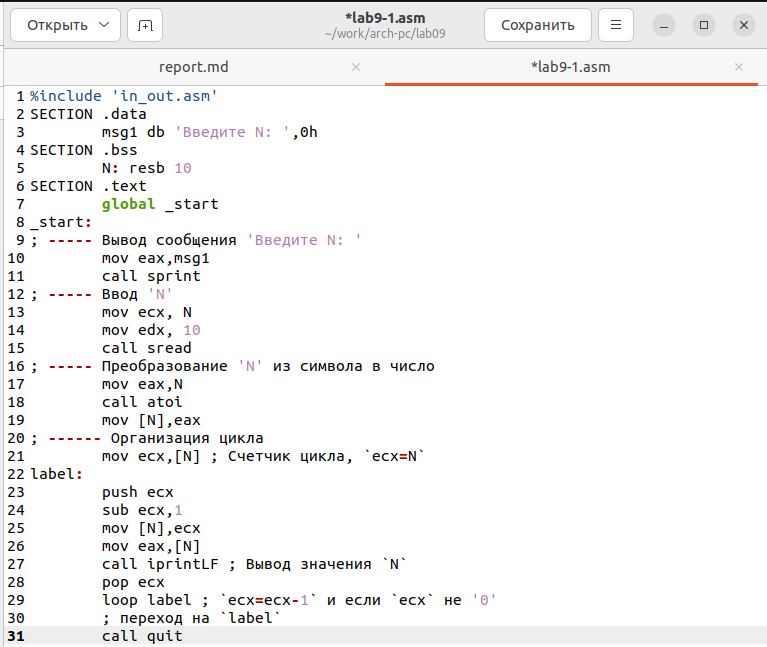

---
## Front matter
title: "Лабораторная работа №9. "
subtitle: "Программирование цикла. Обработка аргументов командной строки."
author: "Боровиков Даниил Александрович"

## Generic otions
lang: ru-RU
toc-title: "Содержание"

## Bibliography
bibliography: bib/cite.bib
csl: pandoc/csl/gost-r-7-0-5-2008-numeric.csl

## Pdf output format
toc: true # Table of contents
toc-depth: 2
lof: true # List of figures
fontsize: 12pt
linestretch: 1.5
papersize: a4
documentclass: scrreprt
## I18n polyglossia
polyglossia-lang:
  name: russian
  options:
	- spelling=modern
	- babelshorthands=true
polyglossia-otherlangs:
  name: english
## I18n babel
babel-lang: russian
babel-otherlangs: english
## Fonts
mainfont: PT Serif
romanfont: PT Serif
sansfont: PT Sans
monofont: PT Mono
mainfontoptions: Ligatures=TeX
romanfontoptions: Ligatures=TeX
sansfontoptions: Ligatures=TeX,Scale=MatchLowercase
monofontoptions: Scale=MatchLowercase,Scale=0.9
## Biblatex
biblatex: true
biblio-style: "gost-numeric"
biblatexoptions:
  - parentracker=true
  - backend=biber
  - hyperref=auto
  - language=auto
  - autolang=other*
  - citestyle=gost-numeric
## Pandoc-crossref LaTeX customization
figureTitle: "Рис."
tableTitle: "Таблица"
listingTitle: "Листинг"
lofTitle: "Список иллюстраций"
lotTitle: "Список таблиц"
lolTitle: "Листинги"
## Misc options
indent: true
header-includes:
  - \usepackage{indentfirst}
  - \usepackage{float} # keep figures where there are in the text
  - \floatplacement{figure}{H} # keep figures where there are in the text
---

# Цель работы

Приобретение навыков написания программ с использованием циклов и
обработкой аргументов командной строки.

# Выполнение лабораторной работы

Создадим каталог для программам лабораторной работы № 9, перейдем в него и создадим файл lab9-1.asm(рис. [-@fig:001])

{ #fig:001 width=70% }

Введем в файл lab9-1.asm текст программы из листинга 9.1.(рис. [-@fig:002])

{ #fig:002 width=70% }

Создадим исполняемый файл и запустим его.(рис. [-@fig:003])

{ #fig:003 width=70% }

Число проходов цикла соответствует введенному значению N.

Далее изменим текст программы добавив изменение значение регистра ecx в цикле(рис. [-@fig:004])

{ #fig:004 width=70% }

Создадим исполняемый файл исправленного текста программы lab9-1.asm и запустите его.(рис. [-@fig:005])

{ #fig:005 width=70% }

Программа выводит некорректные значения из-за использования регистра ecx в теле цикла loop. Значения ecx перезаписываются в eax и выводятся на экран. Число проходов не соответствует значению N, как это было в первоначальной версии программы.

Внесем изменения в текст программы добавив команды push и pop (добавления в стек и извлечения из стека) для сохранения значения счетчика цикла loop:(рис. [-@fig:006])

{ #fig:006 width=70% }

Создадим исполняемый файл и запустим его(рис. [-@fig:007])

{ #fig:007 width=70% }

В данном случае число проходов цикла соответствует значению, введенному с клавиатуры

Создадим файл lab9-2.asm в каталоге ~/work/arch-pc/lab09. Внимательно изучим текст программы из листинга 9.2 и введем в lab9-2.asm.(рис. [-@fig:008])

{ #fig:008 width=70% }

Создадим измененный исполняемый файл и запустим его(рис. [-@fig:009])

{ #fig:009 width=70% }

Программой было обработано 4 аргумента.

Создадим файл lab9-3.asm в каталоге ~/work/arch-pc/lab09. Внимательно изучим текст программы из листинга 9.3 и введем в lab9-3.asm.(рис. [-@fig:010])

{ #fig:010 width=70% }

Создадим исполняем файл и запустим его, указав аргументы(рис. [-@fig:011])

{ #fig:011 width=70% }

Изменим файл lab9-3.asm для вычисления произведения аргументов командной строки (рис. [-@fig:012])

{ #fig:012 width=70% }

Создадим исполняем файл и запустим его, указав аргументы(рис. [-@fig:013])

{ #fig:013 width=70% }

Листинг программы:

%include 'in_out.asm'

SECTION .data

msg db "Результат: ",0

SECTION .text

global _start

_start:

pop ecx ; Извлекаем из стека в `ecx` количество

; аргументов (первое значение в стеке)

pop edx ; Извлекаем из стека в `edx` имя программы

; (второе значение в стеке)

sub ecx,1 ; Уменьшаем `ecx` на 1 (количество

; аргументов без названия программы)

mov esi, 1 ; Используем `esi` для хранения

; промежуточных сумм

next:

cmp ecx,0h ; проверяем, есть ли еще аргументы

jz _end ; если аргументов нет выходим из цикла

; (переход на метку `_end`)

pop eax ; иначе извлекаем следующий аргумент из стека

call atoi ; преобразуем символ в число

mov ebx,eax

mov eax,esi

mul ebx

mov esi,eax

; след. аргумент `esi=esi+eax`

loop next ; переход к обработке следующего аргумента

_end:

mov eax, msg ; вывод сообщения "Результат: "

call sprint

mov eax, esi ; записываем сумму в регистр `eax`

call iprintLF ; печать результата

call quit ; завершение программы

# Самостоятельная работа

Мой вариант номер 7

Напишем программу, которая находит сумму значений функции f(x)
для x = x1 , x2 , ..., xn , т.е. программа должна выводить значение f(x1) + f(x2)+...+f(xn). Значения xi передаются как аргументы. Вид функции f(x)
выберем из таблицы 9.1 вариантов заданий в соответствии с вариантом номер 7, по-
лученным при выполнении лабораторной работы № 7. Создадим исполня-
емый файл и проверьте его работу на нескольких наборах x = x1 , x2 , ..., xn .(рис. [-@fig:014])

{ #fig:014 width=70% }

 Создадим исполняем файл и запустим его, указав аргументы(рис. [-@fig:015])

{ #fig:015 width=70% }

Листинг программы:

%include 'in_out.asm'

SECTION .data

fun db "Функция: f(x)=3(X+2)",0

msg db "Результат: ",0

SECTION .text

global _start

_start:

pop ecx ; Извлекаем из стека в `ecx` количество

; аргументов (первое значение в стеке)

pop edx ; Извлекаем из стека в `edx` имя программы

; (второе значение в стеке)

sub ecx,1 ; Уменьшаем `ecx` на 1 (количество

; аргументов без названия программы)

mov esi, 0 ; Используем `esi` для хранения

; промежуточных сумм

next:

cmp ecx,0h ; проверяем, есть ли еще аргументы

jz _end ; если аргументов нет выходим из цикла

; (переход на метку `_end`)

pop eax ; иначе извлекаем следующий аргумент из стека

call atoi ; преобразуем символ в число

add eax,2

mov ebx,3

mul ebx

add esi,eax

; след. аргумент `esi=esi+eax`

loop next ; переход к обработке следующего аргумента

_end:

mov eax, fun

call sprintLF

mov eax, msg ; вывод сообщения "Результат: "

call sprint

mov eax, esi ; записываем сумму в регистр `eax`

call iprintLF ; печать результата

call quit ; завершение программы

# Выводы

В ходе лабораторной работы мы приобрели наыки написания программ с использованием циклов и обработкой аргументов командной строки.

https://github.com/daBorovikov/study_2022-2023_arh-pc-

