---
## Front matter
title: "Лабораторная работа №10. "
subtitle: "Понятие подпрограммы. Отладчик GDB."
author: "Боровиков Даниил Александрович"

## Generic otions
lang: ru-RU
toc-title: "Содержание"

## Bibliography
bibliography: bib/cite.bib
csl: pandoc/csl/gost-r-7-0-5-2008-numeric.csl

## Pdf output format
toc: true # Table of contents
toc-depth: 2
lof: true # List of figures
fontsize: 12pt
linestretch: 1.5
papersize: a4
documentclass: scrreprt
## I18n polyglossia
polyglossia-lang:
  name: russian
  options:
	- spelling=modern
	- babelshorthands=true
polyglossia-otherlangs:
  name: english
## I18n babel
babel-lang: russian
babel-otherlangs: english
## Fonts
mainfont: PT Serif
romanfont: PT Serif
sansfont: PT Sans
monofont: PT Mono
mainfontoptions: Ligatures=TeX
romanfontoptions: Ligatures=TeX
sansfontoptions: Ligatures=TeX,Scale=MatchLowercase
monofontoptions: Scale=MatchLowercase,Scale=0.9
## Biblatex
biblatex: true
biblio-style: "gost-numeric"
biblatexoptions:
  - parentracker=true
  - backend=biber
  - hyperref=auto
  - language=auto
  - autolang=other*
  - citestyle=gost-numeric
## Pandoc-crossref LaTeX customization
figureTitle: "Рис."
tableTitle: "Таблица"
listingTitle: "Листинг"
lofTitle: "Список иллюстраций"
lotTitle: "Список таблиц"
lolTitle: "Листинги"
## Misc options
indent: true
header-includes:
  - \usepackage{indentfirst}
  - \usepackage{float} # keep figures where there are in the text
  - \floatplacement{figure}{H} # keep figures where there are in the text
---

# Цель работы

Приобретение навыков написания программ с использованием подпрограмм. Знакомство с методами отладки при помощи GDB и его основными возможностями.

# Выполнение лабораторной работы

Создадим каталог для программ лабораторной работы № 10, перейдем в него и создадим файл lab10-1.asm(рис. [-@fig:001])

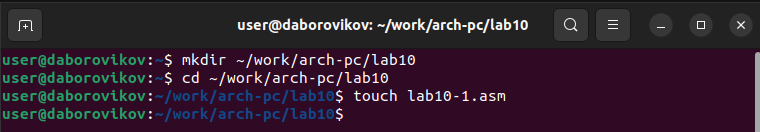{ #fig:001 width=70% }

Введем в файл lab10-1.asm текст программы из листинга 10.1.(рис. [-@fig:002])

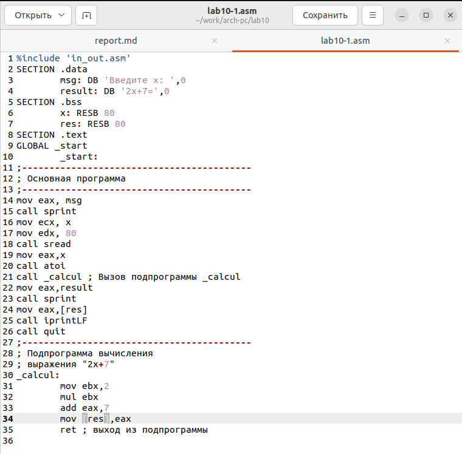{ #fig:002 width=70% }

Создадим исполняемый файл и запустим его.(рис. [-@fig:003])

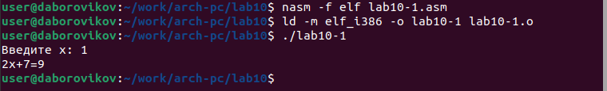{ #fig:003 width=70% }

Далее изменим текст программы добавив подпрограмму _subcalcul в подпрограмму _calcul, для вычисления выражения f(g(x)), где x вводится с клавиатуры, f(x) = 2x + 7, g(x) = 3x − 1. Т.е. x передается в подпрограмму _calcul из нее в подпрограмму _subcalcul, где вычисляется выражение 𝑔(𝑥), результат возвращается в _calcul и вычисляется выражение f(g(x)). Результат возвращается в основную программу для вывода результата на экран.(рис. [-@fig:004])

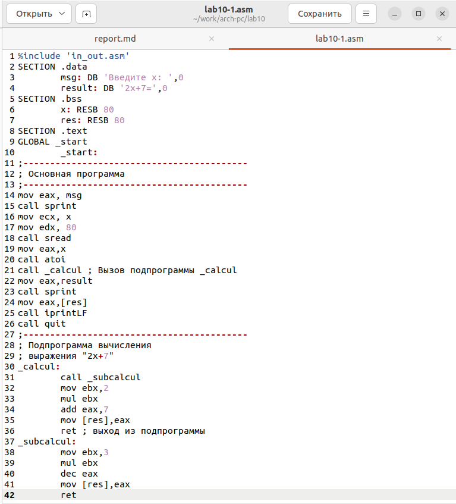{ #fig:004 width=70% }

Создадим исполняемый файл исправленного текста программы lab10-1.asm и запустиv его.(рис. [-@fig:005])

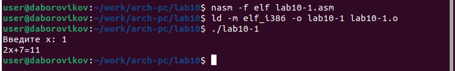{ #fig:005 width=70% }

Создадим файл lab10-2.asm с текстом программы из Листинга 10.2. (Програм-
ма печати сообщения Hello world!):(рис. [-@fig:006])

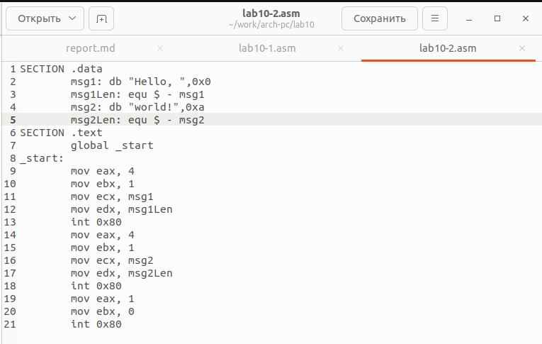{ #fig:006 width=70% }

Получим исполняемый файл. Для работы с GDB в исполняемый файл добавим отладочную информацию, для этого трансляцию программ проведем с ключом ‘-g’.

nasm -f elf -g -l lab10-2.lst lab10-2.asm

ld -m elf_i386 -o lab10-2 lab10-2.o

Загрузим исполняемый файл в отладчик gdb:

user@dk4n31:~$ gdb lab10-2

Проверим работу программы, запустив ее в оболочке GDB с помощью команды run (сокращённо r):

Для более подробного анализа программы установим брейкпоинт на метку _start, с которой начинается выполнение любой ассемблерной программы, и запустим её.(рис. [-@fig:007])

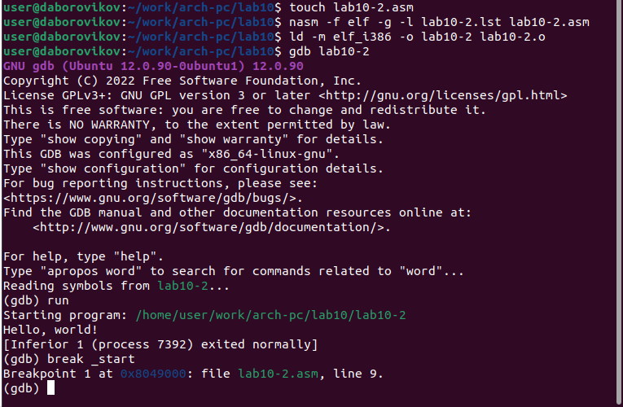{ #fig:007 width=70% }

Посмотрим дисассимилированный код программы с помощью команды disassemble начиная с метки _start

(gdb) disassemble _start

Переключимся на отображение команд с Intel’овским синтаксисом, введя команду set disassembly-flavor intel

(gdb) set disassembly-flavor intel

(gdb) disassemble _start(рис. [-@fig:008])

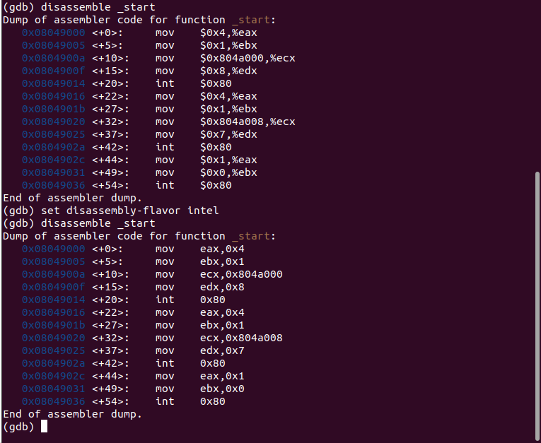{ #fig:008 width=70% }

Синтаксисы машинных команд в режимах ATT и Intel заключаются в наличии символов "$" и "&" в ATT режиме.

Включим режим псевдографики для более удобного анализа программы(рис. [-@fig:009])

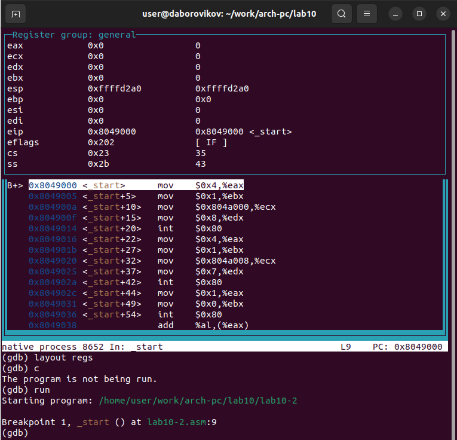{ #fig:009 width=70% }

Проверим брейкпоинты командой info breakpoints(рис. [-@fig:010])

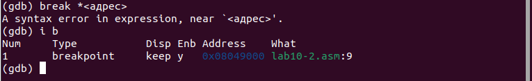{ #fig:010 width=70% }

Установим еще один брейкпоинт по адресу инструкции и проверим(рис. [-@fig:011])

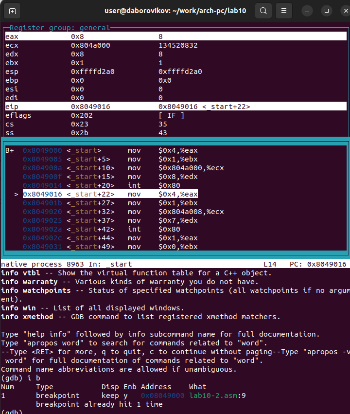{ #fig:011 width=70% }

Выполним 5 инструкций с помощью команды stepi (или si) и проследите за изменением значений регистров. Посмотрим содержимое регистров с помощью команды inforegisters (рис. [-@fig:012])

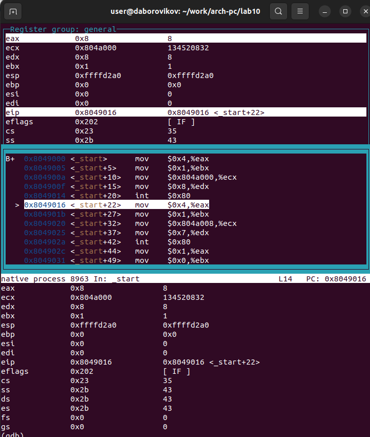{ #fig:012 width=70% }

Посмотрим значение переменной msg1 по имени, а msg2 по адресу
(рис. [-@fig:013])

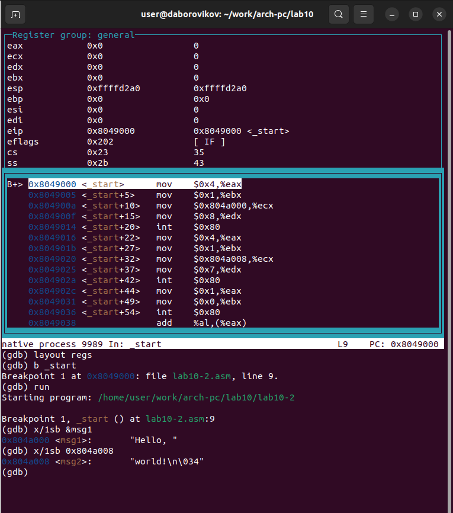{ #fig:013 width=70% }

Изменим первый символ переменной msg1(рис. [-@fig:014])

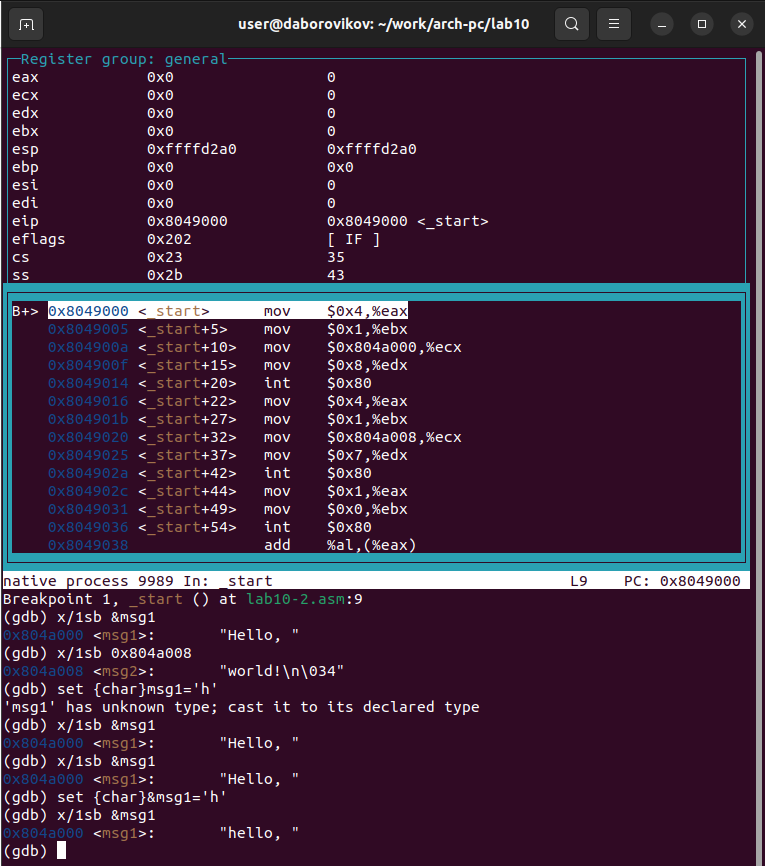{ #fig:014 width=70% }

 Изменим символы переменной msg2(рис. [-@fig:015])

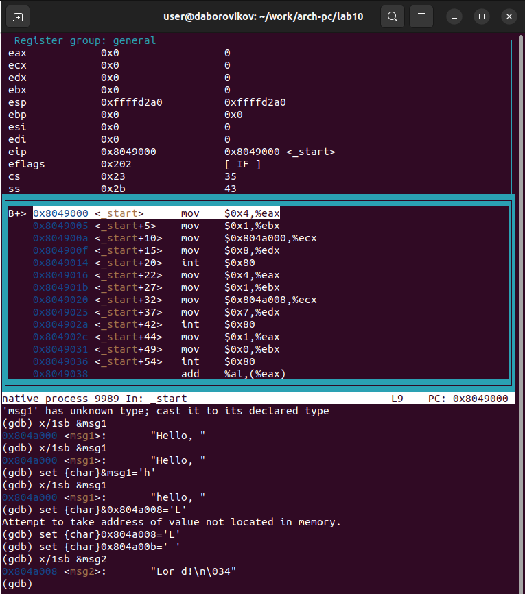{ #fig:015 width=70% }

Выведеv в различных форматах (в шестнадцатеричном формате, в двоичном
формате и в символьном виде) значение регистра edx.(рис. [-@fig:016])

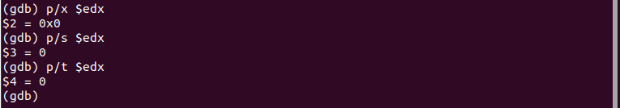{ #fig:016 width=70% }

С помощью команды set изменим значение регистра ebx:(рис. [-@fig:017])

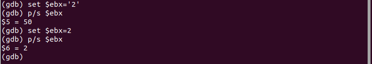{ #fig:017 width=70% }
Разница в командах в том, что примваиваем значение числа во втором случае, а в первом символ '2'.

Завершим выполнение программы с помощью команды continue (сокра-
щенно c) или stepi (сокращенно si) и выйдите из GDB с помощью команды
quit (сокращенно q)

Скопируем файл lab9-2.asm, созданный при выполнении лабораторной ра-
боты №9, с программой выводящей на экран аргументы командной строки
(Листинг 9.2) в файл с именем lab10-3.asm и создадим исполняемый файл.(рис. [-@fig:018])

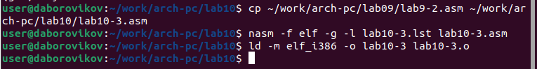{ #fig:018 width=70% }

Для загрузки в gdb программы с аргументами используем ключ
--args. Загрузим исполняемый файл в отладчик, указав аргументы(рис. [-@fig:019])

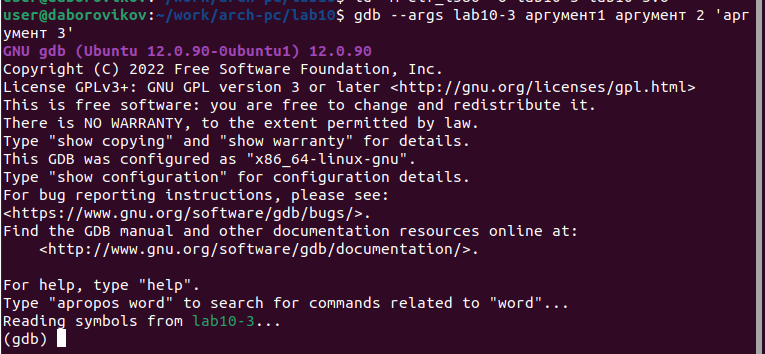{ #fig:019 width=70% }

Для начала установим брейкпоинт перед первой инструкцией в программе
и запустим ее.(рис. [-@fig:020])

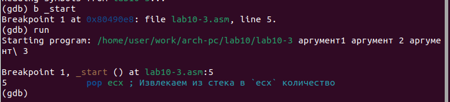{ #fig:020 width=70% }

Посмотриv позиции стека c шагом +4(рис. [-@fig:021])

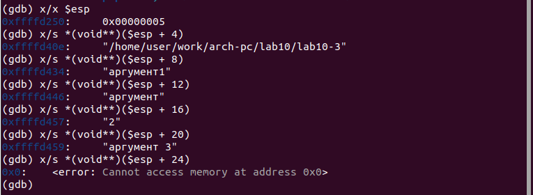{ #fig:021 width=70% }

Шаг равен размеру переменной - 4 байтам.
#Самостоятельная работа

Преобразуем программу из лабораторной работы 9 задание 1 для сам работы, чтобы вычисления были в подпрограмме(рис. [-@fig:022])

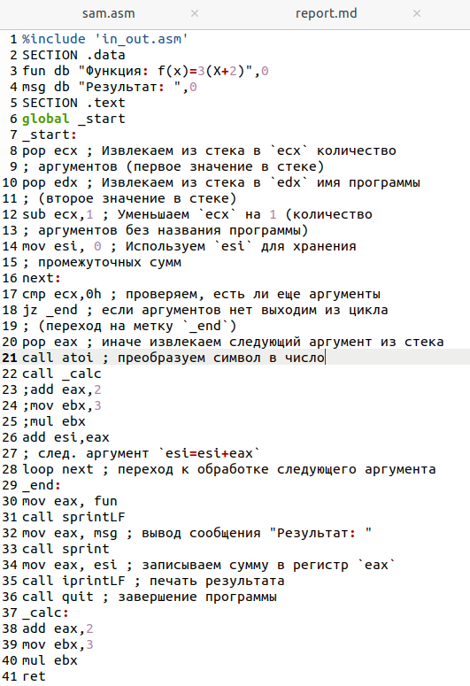{ #fig:022 width=70% }

Создадим испоняемый файл для проверки программы(рис. [-@fig:030])

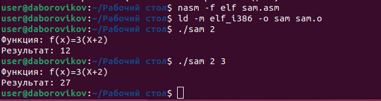{ #fig:030 width=70% }

Создадим файл для задания 2 сам. работы. И ввдём программу из листинга 10.3(рис. [-@fig:023])

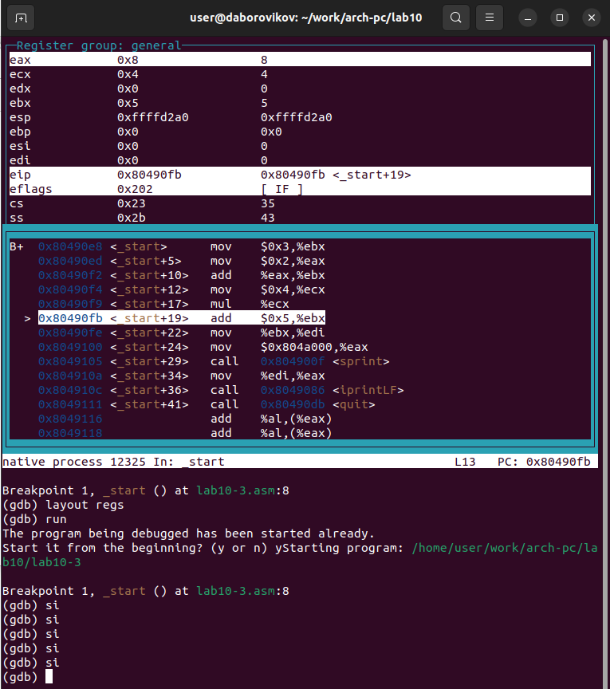{ #fig:023 width=70% }

Проверим программу с помощью отладчика и найдем ошибку(рис. [-@fig:024])

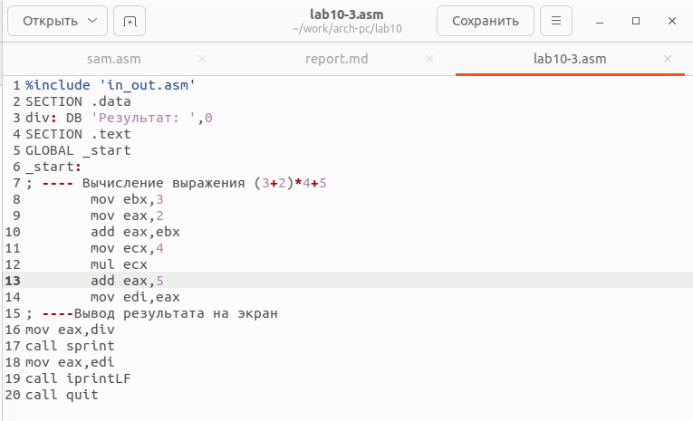{ #fig:025 width=70% }

Исправим ошибку(рис. [-@fig:025])

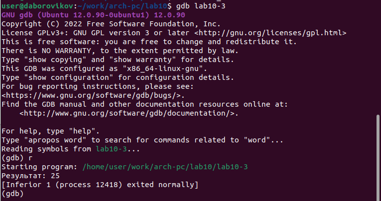{ #fig:025 width=70% }

Запустим рабочую программу(рис. [-@fig:026])

{ #fig:026 width=70% }

# Выводы
Приобретение навыков написания программ с использованием подпрограмм.
Знакомство с методами отладки при помощи GDB и его основными возможно-
стями.

В ходе лабораторной работы мы приобрели навыки написания программ с использованием подпрограмм, познакомились с методами отладки при помощи GDB и его основными возможностями.

https://github.com/daBorovikov/study_2022-2023_arh-pc-

