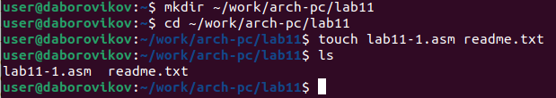
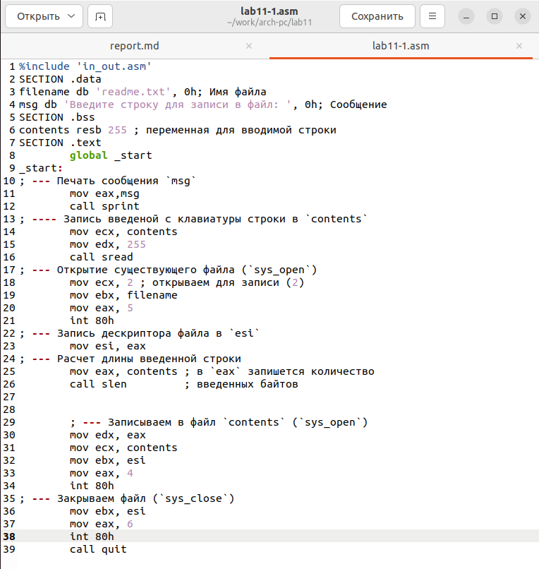
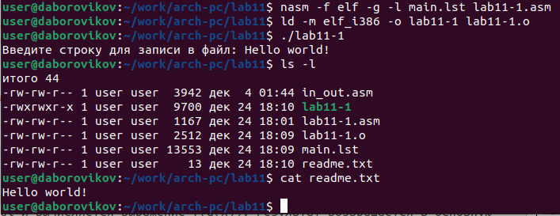
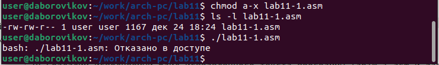
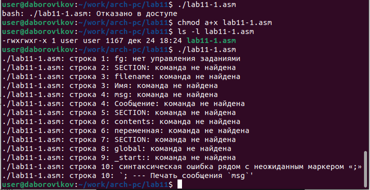
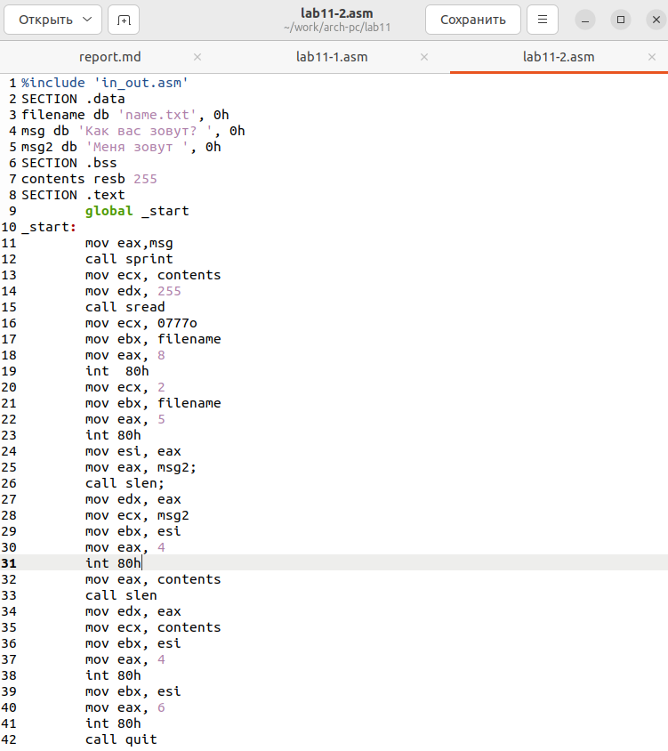
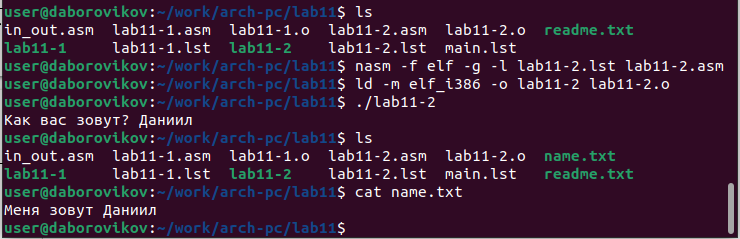

---
## Front matter
title: "Лабораторная работа №11. "
subtitle: "Приобретение навыков написания программ для работы с файлами."
author: "Боровиков Даниил Александрович"

## Generic otions
lang: ru-RU
toc-title: "Содержание"

## Bibliography
bibliography: bib/cite.bib
csl: pandoc/csl/gost-r-7-0-5-2008-numeric.csl

## Pdf output format
toc: true # Table of contents
toc-depth: 2
lof: true # List of figures
fontsize: 12pt
linestretch: 1.5
papersize: a4
documentclass: scrreprt
## I18n polyglossia
polyglossia-lang:
  name: russian
  options:
	- spelling=modern
	- babelshorthands=true
polyglossia-otherlangs:
  name: english
## I18n babel
babel-lang: russian
babel-otherlangs: english
## Fonts
mainfont: PT Serif
romanfont: PT Serif
sansfont: PT Sans
monofont: PT Mono
mainfontoptions: Ligatures=TeX
romanfontoptions: Ligatures=TeX
sansfontoptions: Ligatures=TeX,Scale=MatchLowercase
monofontoptions: Scale=MatchLowercase,Scale=0.9
## Biblatex
biblatex: true
biblio-style: "gost-numeric"
biblatexoptions:
  - parentracker=true
  - backend=biber
  - hyperref=auto
  - language=auto
  - autolang=other*
  - citestyle=gost-numeric
## Pandoc-crossref LaTeX customization
figureTitle: "Рис."
tableTitle: "Таблица"
listingTitle: "Листинг"
lofTitle: "Список иллюстраций"
lotTitle: "Список таблиц"
lolTitle: "Листинги"
## Misc options
indent: true
header-includes:
  - \usepackage{indentfirst}
  - \usepackage{float} # keep figures where there are in the text
  - \floatplacement{figure}{H} # keep figures where there are in the text
---

# Цель работы

Приобретение навыков написания программ с использованием подпрограмм. Знакомство с методами отладки при помощи GDB и его основными возможностями.

# Выполнение лабораторной работы

Создадим каталог для программам лабораторной работы № 11, перейдем в него и создадим файл lab11-1.asm и readme.txt(рис. [-@fig:001])

{ #fig:001 width=70% }

Введем в файл lab11-1.asm текст программы из листинга 11.1 (Программа
записи в файл сообщения). (рис. [-@fig:002])

{ #fig:002 width=70% }

Создадим исполняемый файл и проверим его работу.(рис. [-@fig:003])

{ #fig:003 width=70% }

С помощью команды chmod изменим права доступа к исполняемому файлу lab11-1, запретив его выполнение. Попытаемся выполнить файл. Нам отказано в доступе, так как исполнение файла мы заблокировали.(рис. [-@fig:004])

{ #fig:004 width=70% }

С помощью команды chmod изменим права доступа к файлу lab11-1.asm с исходным текстом программы, добавив права на исполнение. Попытаемся выполнить его. При предоставлении доступа к исполнению файл не выполняется и выдает ошибки.(рис. [-@fig:005])

{ #fig:005 width=70% }

Предоставим права доступа к файлу readme.txt в соответствии с вари-
антом 7(rw- rwx rw-). Проверим правильность выполнения с помощью
команды ls -l.(рис. [-@fig:006])

{ #fig:006 width=70% }

# Самостоятельная работа
Напишем программу работающую по следующему алгоритму:

• Вывод приглашения “Как Вас зовут?”

• ввести с клавиатуры свои фамилию и имя

• создать файл с именем name.txt

• записать в файл сообщение “Меня зовут”

• дописать в файл строку введенную с клавиатуры

• закрыть файл
(рис. [-@fig:007])

{ #fig:007 width=70% }

Листинг программы lab11-2.asm:

%include 'in_out.asm'

SECTION .data

filename db 'name.txt', 0h 

msg db 'Как вас зовут? ', 0h 

msg2 db 'Меня зовут ', 0h 

SECTION .bss

contents resb 255 

SECTION .text

	global _start
	
_start:

	mov eax,msg
	
	call sprint
	
	mov ecx, contents
	
	mov edx, 255
	
	call sread
	
	mov ecx, 0777o 
	
	mov ebx, filename 
	
	mov eax, 8 
	
	int  80h
	
	mov ecx, 2 
	
	mov ebx, filename
	
	mov eax, 5
	
	int 80h
	
	mov esi, eax
	
	mov eax, msg2;
	
	call slen;
	
	mov edx, eax
	
	mov ecx, msg2
	
	mov ebx, esi
	
	mov eax, 4
	
	int 80h
	
	mov eax, contents 
	
	call slen 
	
	mov edx, eax
	
	mov ecx, contents
	
	mov ebx, esi
	
	mov eax, 4
	
	int 80h
	
	mov ebx, esi
	
	mov eax, 6
	
	int 80h
	
	call quit
	
Создадим исполняемый файл и проверим наличие файла и его содержимое с помощью команд ls и cat.(рис. [-@fig:008])

{ #fig:008 width=70% }

# Выводы
В ходе лабораторной рабоы мы приобрели навыки написания программ для работы  файлами.

https://github.com/daBorovikov/study_2022-2023_arh-pc-

